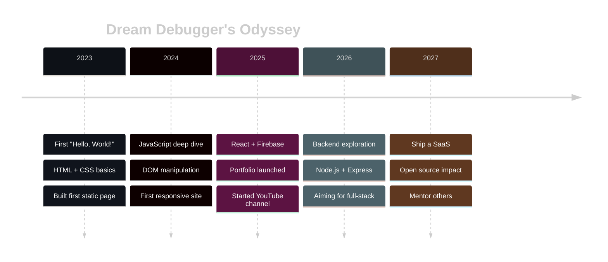

<!-- ╔══════════════════════════════════════════════════════════════════════════╗ -->
<!-- ║                    ✦ DREAM DEBUGGER DEV ✦                                ║ -->
<!-- ║              Crafted with caffeine, curiosity & chaos                    ║ -->
<!-- ╚══════════════════════════════════════════════════════════════════════════╝ -->

<!-- ═══════════════════ ANIMATED WAVE HEADER ═══════════════════ -->
<a href="https://github.com/Dream-Debugger-Dev">
  
</a>

<!-- ═══════════════════ TYPING ANIMATION ═══════════════════ -->
<div align="center">

[;while(alive)+%7B+learn()%3B+build()%3B+repeat()%3B+%7D;I+turn+%E2%98%95+into+%F0%9F%92%BB+and+bugs+into+features;Currently+debugging+reality.exe...;System+online.+Ready+to+collaborate.)](https://git.io/typing-svg)

</div>

<!-- ═══════════════════ HOLOGRAPHIC ID CARD ═══════════════════ -->
<table align="center">
<tr>
<td width="50%" valign="top">

```yaml
╭─────────────────────────────╮
│  ◉ IDENTITY.sys             │
├─────────────────────────────┤
│  name:    "Anshik Kewat"    │
│  alias:   "DreamDebugger"   │
│  origin:  "Hyderabad, IN"   │
│  role:    "Full-Stack Dev"  │
│  status:  ◉ online          │
│  mood:    "building stuff"  │
│  fuel:    ["☕", "🎵", "💡"] │
╰─────────────────────────────╯
```

</td>
<td width="50%" valign="top">

```js
const anshik = {
  pronouns: "he/him",
  code:     ["JS", "Py", "HTML", "CSS"],
  learning: ["React", "Node", "MongoDB"],
  ask_me:   ["web dev", "debugging",
             "animations"],
  tech:     { frontend: "🔥",
              backend:  "🌱",
              devops:   "🔜" },
  motto:    () => "ship it, then polish"
};
```

</td>
</tr>
</table>

<!-- ═══════════════════ SOCIAL ORBIT ═══════════════════ -->
<div align="center">

<a href="https://dream-debugger-dev.github.io/Portfolio/">
  
</a>
<a href="https://www.youtube.com/@DreamDebuggerDev">
  
</a>
<a href="https://www.linkedin.com/in/anshik-kewat-8637harru/">
  
</a>
<a href="https://github.com/Dream-Debugger-Dev">
  
</a>


</div>

<br/>

<!-- ═══════════════════ SECTION: ABOUT ═══════════════════ -->
<picture align="right">
  <source media="(prefers-color-scheme: dark)" srcset="https://raw.githubusercontent.com/Dream-Debugger-Dev/Dream-Debugger-Dev/output/github-contribution-grid-snake-dark.svg" />
  <source media="(prefers-color-scheme: light)" srcset="https://raw.githubusercontent.com/Dream-Debugger-Dev/Dream-Debugger-Dev/output/github-contribution-grid-snake.svg" />
  
</picture>

### `> whoami`

```diff
+ 💻 Self-taught developer from Hyderabad, India
+ 🎨 Obsessed with pixel-perfect UI & smooth animations
+ 🚀 Shipping small projects, learning big things
+ 📺 Sharing my journey on YouTube
+ 🌙 Most productive between 9 PM – 3 AM
! ⚡ Currently leveling up: React ecosystem + Backend
# 🎯 Goal: Ship a SaaS before the year ends
```

### `> cat current_mission.log`

> Building the bridge between beautiful frontends and rock-solid backends — one commit, one bug, one 3 AM "aha!" moment at a time.

<br clear="right"/>

<!-- ═══════════════════ DIVIDER: NEON LINE ═══════════════════ -->


<!-- ═══════════════════ TECH STACK GRID ═══════════════════ -->
<h2 align="center">⚡ Tech Arsenal ⚡</h2>

<div align="center">

**🎨 Languages & Frameworks**

[](https://skillicons.dev)

**🛠️ Tools & Platforms**

[](https://skillicons.dev)

**🌱 Currently Exploring**

[](https://skillicons.dev)

</div>

<!-- ═══════════════════ DIVIDER ═══════════════════ -->


<!-- ═══════════════════ STATS DASHBOARD ═══════════════════ -->
<h2 align="center">📊 Live Dashboard 📊</h2>

<div align="center">

<a href="https://github.com/Dream-Debugger-Dev">
  
  
</a>

<br/><br/>

<a href="https://github.com/Dream-Debugger-Dev">
  
  
</a>

</div>

<!-- ═══════════════════ TROPHY WALL ═══════════════════ -->
<h2 align="center">🏆 Trophy Cabinet 🏆</h2>

<div align="center">
  <a href="https://github.com/ryo-ma/github-profile-trophy">
    
  </a>
</div>

<!-- ═══════════════════ DIVIDER ═══════════════════ -->


<!-- ═══════════════════ PROJECT SHOWCASE ═══════════════════ -->
<h2 align="center">🚀 Featured Builds 🚀</h2>

<div align="center">

<a href="https://github.com/Dream-Debugger-Dev/Portfolio">
  
</a>
<a href="https://github.com/Dream-Debugger-Dev/Anshik-Digital-Solutions">
  
</a>
<a href="https://github.com/Dream-Debugger-Dev/Frontend-Lab">
  
</a>
<a href="https://github.com/Dream-Debugger-Dev/resume-builder">
  
</a>

</div>

<!-- ═══════════════════ DIVIDER ═══════════════════ -->


<!-- ═══════════════════ JOURNEY TIMELINE ═══════════════════ -->
<h2 align="center">🛸 The Journey So Far 🛸</h2>

<table align="center">
<tr>
<td align="center">



</td>
</tr>
</table>

<!-- ═══════════════════ DIVIDER ═══════════════════ -->


<!-- ═══════════════════ FUN FACTS ═══════════════════ -->
<h2 align="center">🎲 Random Access Memory 🎲</h2>

<table align="center">
<tr>
<td valign="top" width="50%">

### 🧠 Brain Dump
<details open>
<summary><b>Hidden thoughts of a dev</b></summary>

- 🌙 **Peak hours:** 9 PM → 3 AM
- ☕ **Coffee count today:** `Math.floor(Math.random()*10)`
- 🎧 **Now playing:** lofi beats to commit to
- 🐛 **Current bug:** always `undefined is not a function`
- 💭 **Dream project:** an AI-powered code debugger
- 🎬 **Favorite trope:** "it works on my machine"

</details>

</td>
<td valign="top" width="50%">

### 🎮 Dev Stats (self-reported)

```
Caffeine tolerance  ▰▰▰▰▰▰▰▰▰▱  98%
CSS centering skill ▰▰▰▰▰▰▰▰▱▱  80%
"It works!" moments ▰▰▰▰▰▰▰▰▰▰ 100%
Stack Overflow karma ▰▰▰▰▱▱▱▱▱▱  40%
Patience with bugs  ▰▰▰▱▱▱▱▱▱▱  30%
Curiosity           ▰▰▰▰▰▰▰▰▰▰ 100%
```

</td>
</tr>
</table>

<!-- ═══════════════════ DIVIDER ═══════════════════ -->


<!-- ═══════════════════ QUOTE OF THE DAY ═══════════════════ -->
<h2 align="center">💬 Wisdom of the Day 💬</h2>

<div align="center">


</div>

<!-- ═══════════════════ SPOTIFY NOW PLAYING (optional) ═══════════════════ -->
<!-- Uncomment after connecting Spotify to https://github.com/kittinan/spotify-github-profile
<div align="center">
  <a href="https://spotify-github-profile.kittinanx.com/api/view?uid=YOUR_UID&redirect=true">
    
  </a>
</div>
-->

<!-- ═══════════════════ COLLAB CTA ═══════════════════ -->
<h2 align="center">🤝 Let's Build Something Together 🤝</h2>

<div align="center">

<table>
<tr>
<td align="center">

I'm open to:

🧩 **Open-source contributions** • 💡 **Side projects** • 🎓 **Mentorship (both ways)** • 🎨 **UI collabs** • 🚀 **Cool ideas I haven't heard yet**

<br/>

<a href="https://www.linkedin.com/in/anshik-kewat-8637harru/">
  
</a>
<a href="https://dream-debugger-dev.github.io/Portfolio/">
  
</a>

</td>
</tr>
</table>

</div>

<!-- ═══════════════════ WAVE FOOTER ═══════════════════ -->


<div align="center">

**⭐ If this profile sparked something, drop a star on [one of my repos](https://github.com/Dream-Debugger-Dev?tab=repositories) — it genuinely makes my day.**

<sub>`// Crafted with ❤️, lots of ☕, and an unreasonable amount of console.log()`</sub>

</div>
